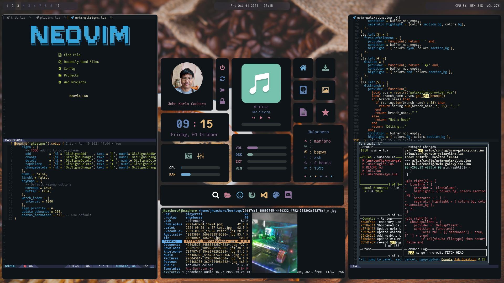

## Neovim IDE
#####  --- A neovim configuration base in LUA ---

#### Awesome Plugins that are used
- **lsp-trouble** - to jumping between lsp warnings
- **nvim-treesitter** - for accurate syntax highlighting
- **vim-windowswap** - to swap windows
- **nvim-telescope** - to preview files while searching
- **ctrlsf.vim** and **vim-visual-multi** - to find and replace some text with multi-cursor support
- **vim-easy-align** - (gaip) Easy align texts
- **vim-blade** - Laravel blade syntax highlighting

#### What's new
- Laravel blade syntax and emmet
- MultiCursor support
- Mighty FZF

#### Packages Required
- Neovim 0.7+ (required)
- ripgrep
- fd and ueberzug - for some reason required by Telescope media files
- fzf

#### LSP Auto-install
* bash - Done
* css - Done
* html - Done
* json - Done
* lua - Done
* php - Done
* python - Done
* tailwind - Done
* vim - Done
* yaml - Done
* vue - Done
* emmet ls - Done

#### TODO
* Improve Keybindings along the way
* Formatters for various web frameworks
* Make status bar, indent guides and other plugins match theme colors
* Find Galaxyline replacement (statusline)
* Add FZF symbols, diagnostics, etcx9999999, in keybinds
